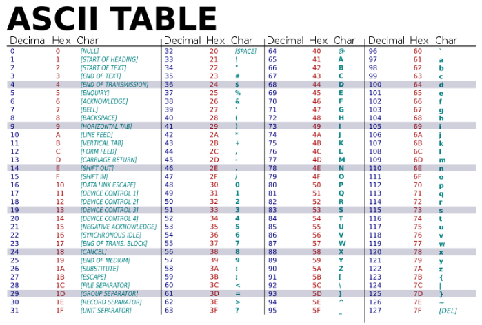

# 5.1 Character Class

Character (char) merupakan tipe data primitif di Java yang digunakan untuk menyimpan satu karakter Unicode pada satu waktu. Nilainya dapat berupa huruf kecil, huruf besar, angka, maupun simbol khusus, dan ditulis menggunakan tanda petik tunggal (' ').

Untuk menghindari perbedaan dalam pembacaan karakter antar perangkat, digunakan skema coding yang bernama ASCII (American Standard Code for Information Interchange) sebagai acuan pengkodean karakter. Table ASCII dapat dilihat pada gambar berikut.



## 5.1.1 Char Declaration
Character dideklarasikan dengan menggunakan single quotes('').

Contoh penggunaan :

```java
char ch = 'a';
char digit = '5';
char symbol = '#';

// Unicode for uppercase Greek omega character
char uniChar = '\u039A';
```

## 5.1.2 Escape Sequence
Karakter yang diawali dengan garis miring terbalik (\) disebut escape sequence dan memiliki makna khusus bagi kompiler. Dengan escape sequence, Anda dapat menampilkan karakter tertentu dalam teks tanpa menyebabkan kesalahan penafsiran.

Contohnya, karakter \n digunakan dalam System.out.println() untuk membuat baris baru setelah teks dicetak.

Berikut merupakan escape sequence di Java:
Escape Sequence          | Deskripsi 
---------------------------- | ------ 
`\t`       | Menyisipkan karakter tab pada teks di titik ini. Ini digunakan untuk membuat jarak horizontal seperti ketika Anda menekan tombol "Tab" pada keyboard.
`\b`       | Menyisipkan karakter backspace pada teks di titik ini. Ini digunakan untuk menghapus karakter sebelumnya dalam teks.
`\n`       | Menyisipkan karakter newline (baris baru) pada teks di titik ini. Ini digunakan untuk memindahkan teks ke baris berikutnya.
`\r` | Menyisipkan karakter carriage return pada teks di titik ini. Ini sering digunakan bersama dengan newline `\n` untuk membuat baris baru dalam teks.
`\'` | Menyisipkan karakter tanda kutip tunggal (single quote) pada teks di titik ini. Ini digunakan saat Anda ingin mencetak tanda kutip tunggal dalam teks yang diapit oleh tanda kutip tunggal.
`\"`    | Menyisipkan karakter tanda kutip ganda (double quote) pada teks di titik ini. Ini digunakan saat Anda ingin mencetak tanda kutip ganda dalam teks yang diapit oleh tanda kutip ganda.
`\\` |  Menyisipkan karakter backslash pada teks di titik ini. Ini digunakan saat Anda ingin mencetak karakter backslash dalam teks.
